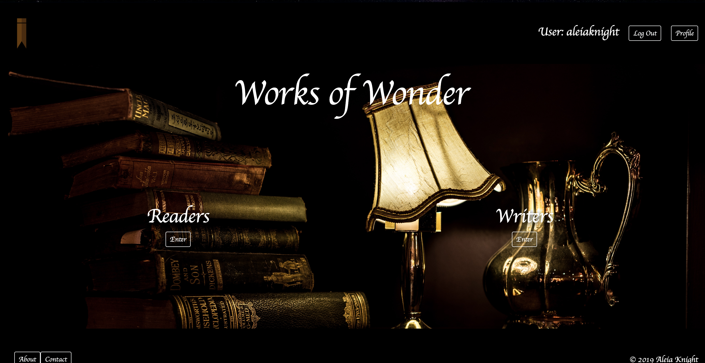

# Works of Wonder

## Motivation
This is a site of 2 parts:
Secondly, to actively practice and display a full-stack web development skillset.


## Live Site
[Live Site] ('worksofwonder.herokuapp.com')

## Built With
* Python 3
* Django
* HTML
* CSS
* SQLLite
* Bootstrap

## Code Example
```
def upload(request):
    if request.method == 'POST':
        upload_form = ArticleForm(request.POST)
        if  upload_form.is_valid():
            upload_form.save()
            username =  upload_form.cleaned_data.get('username')
            messages.success(request, f'Account created for {username} ')
            return redirect('readers')
    else:
            upload_form = ArticleForm()
    return render(request, 'entries/upload.html', {'upload_form': upload_form})

```

## Image


## How to Use
Visit the Live Site! Test out Functionality, Peruse, and Enjoy!

## Contribute
Please leave feedback, bugs, etc. to this project by leaving comments and issues!

## Credits

